<!--
 * @Author: Shadows_Lunarfox 91894334+ShadowsLunarfox@users.noreply.github.com
 * @Date: 2026-07-30 16:33:16
 * @LastEditors: Shadows_Lunarfox 91894334+ShadowsLunarfox@users.noreply.github.com
 * @LastEditTime: 2026-07-30 16:33:35
 * @FilePath: \ShadowsLunarfox\README.md
 * @Description: 这是默认设置,请设置`customMade`, 打开koroFileHeader查看配置 进行设置: https://github.com/OBKoro1/koro1FileHeader/wiki/%E9%85%8D%E7%BD%AE
-->
# 💫 About Me:
# Hi there, I'm Shadows_Lunarfox 🦊✨  > *"My code works fine on my machine, I have no idea why it fails on yours."* ☕  来自马来西亚吉隆坡的 **Baby Furry** 程序员 🍼。平时喜欢写代码、做网站、折腾游戏，顺便在代码注释里留下各种自己看不懂的悬案。

  

  

  

# 💻 Tech Stack:
      

### 🌐 Languages (我会说的语言)
`中文` | `English` | `马来文 / Bahasa Melayu` | `日本語（少しだけ）` | `广东话 / Cantonese`

### 🔗 Let's Connect (找我挂机/聊天)

  
  
  
  
  

# 📊 GitHub Stats:
 
 

<!-- Proudly created with GPRM ( https://gprm.itsvg.in ) -->
